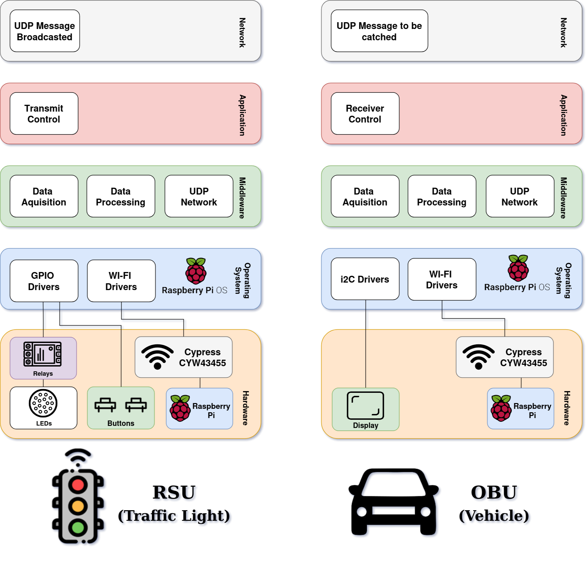
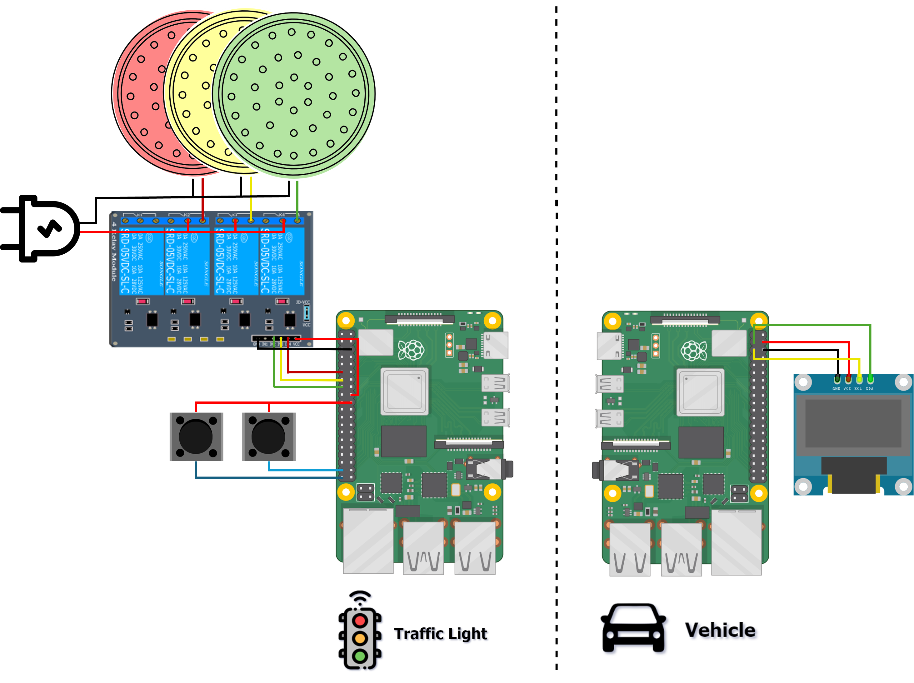
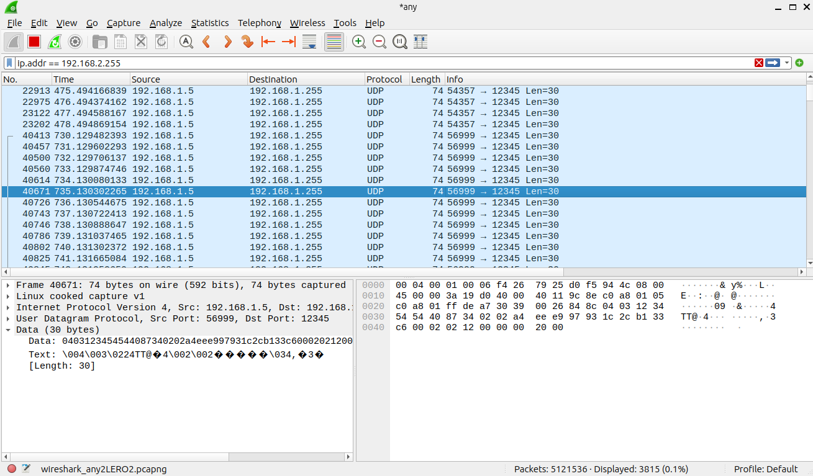
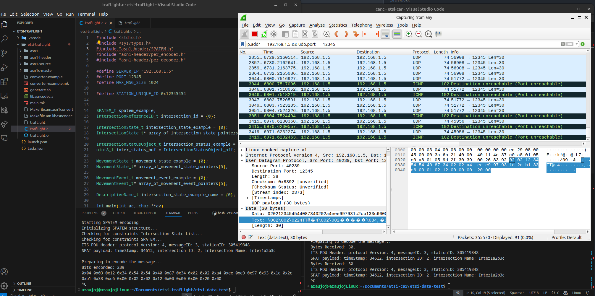

# TrafficLightV2I

V2I (Vehicle-to-Infrastructure) project with two Raspberry Pi devices:
- RSU (Traffic Light): simulates a traffic light, generates SPATEM messages, and sends UDP broadcast.
- OBU (Vehicle): receives and decodes the message, then shows status on an OLED display.

The goal is to demonstrate an end-to-end ETSI SPATEM flow with local network transmission, terminal logs, and Wireshark validation.

## Academic Context

This repository is the implementation artifact of the academic project described in:

- `Documentation/Connected_Traffic_Light.pdf`

The report covers state of the art, architecture/design decisions, implementation details, and verification of SPATEM + UDP communication.

## Overview

The system uses ASN.1 + PER to serialize/deserialize SPATEM.

Main flow:
1. The RSU updates traffic light states (green/yellow/red/pedestrian/emergency).
2. The RSU updates and encodes SPATEM.
3. The RSU sends UDP broadcast to `192.168.1.255:12345`.
4. The OBU receives the frame, decodes it, and displays the result on OLED.

## Architecture



## Hardware




## Project Structure

- `etsi-trafLight/`: RSU side (SPATEM transmitter)
- `etsi-car/`: OBU side (SPATEM receiver)
- `display/`: SSD1306 OLED library (I2C)
- `Test-Code/`: isolated tests (UDP broadcast, state logic, timing)
- `Documentation/`: images and demo video

## Requirements

- Raspberry Pi OS (or equivalent Linux)
- `gcc`, `make`
- `wiringPi`
- `asn1c` (optional, for ASN.1 code regeneration)
- Wireshark (for network validation)

## Design Highlights

- ETSI-oriented SPATEM structure and workflow.
- ASN.1 definitions converted to C codec support using `asn1c`.
- PER encoding/decoding pipeline for SPATEM payloads.
- UDP broadcast communication between RSU and OBU.
- GPIO-based traffic light state machine with pedestrian and emergency handling.
- OLED output for decoded message visibility on the OBU.

## Build

### RSU (Traffic Light)

```bash
cd etsi-trafLight && make -f main.mk
```

### OBU (Vehicle)

```bash
cd etsi-car && make -f main.mk
```

## Execution

Use two devices (or two terminals in a test environment):

1. On RSU, run the transmitter:

```bash
cd etsi-trafLight && ./main
```

2. On OBU, run the receiver:

```bash
cd etsi-car && ./main
```

3. Make sure both Raspberry Pi devices are on the same network with broadcast enabled.

## Network Parameters

- Broadcast IP: `192.168.1.255`
- UDP Port: `12345`
- Maximum message size: `2048` bytes

## Traffic Light States

Implemented in FSM:
- `STATE_GREEN`
- `STATE_YELLOW`
- `STATE_RED`
- `STATE_PEDESTRIAN`
- `STATE_EMERGENCY`

Base times (ms):
- Green: `8000`
- Yellow: `2000`
- Red: `4000`
- Pedestrian: `10000`
- Emergency: `12000`

## Wireshark Validation

Useful filter:

```text
ip.addr == 192.168.1.255 && udp.port == 12345
```

Capture examples:





## Demo Video

Demo video file:

- `Documentation/Demo.MP4`

## Useful Commands

```bash
ssh pi@raspberrypi.local
hostname -I
sudo nmcli dev wifi list
sudo nmcli connection show
sudo nmcli dev wifi connect <wifi_network_name> password <wifi_password>
```